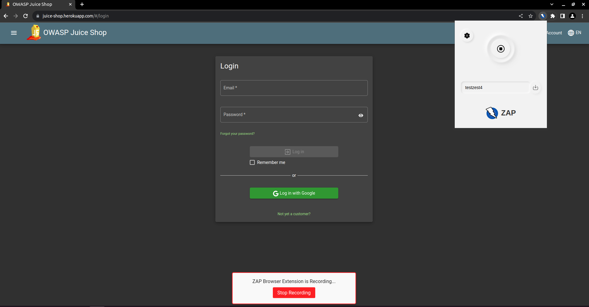
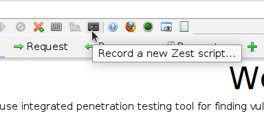
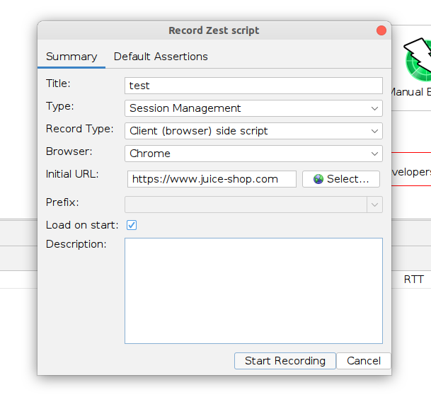
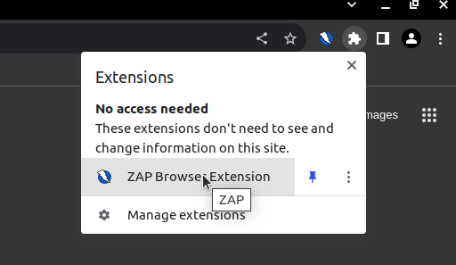
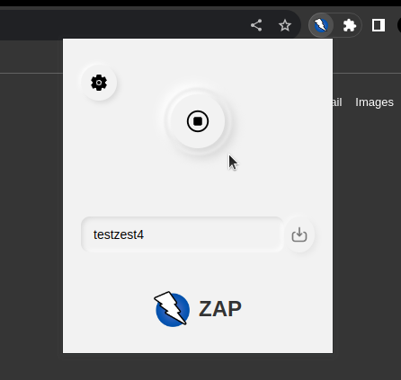
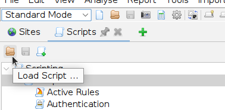

# GSoC 2023 Browser Recorder

## Embarking on a New Adventure with Google Summer of Code 2023

This summer, I embarked on an amazing adventure: Google Summer of Code 2023. For a developer like me, this program is the epitome of innovation and learning. What could be more exciting than collaborating with brilliant minds from around the world on projects that push the boundaries of technology? As I delved into the program, I found myself drawn to an exceptional project: the ZAP Browser Recorder.

## The Challenge

Imagine this scenario: you're a web developer or a cybersecurity enthusiast, determined to ensure a website's security by using the renowned Zed Attack Proxy (ZAP). But, before you even start testing for vulnerabilities, you need to navigate through various pre-task activities like logging in or setting up a user session. These activities not only consume valuable time but can also lead to frustration, hindering the overall testing process. This is where the ZAP Browser Recorder project comes in. By automating the script generation process, this project aims to streamline the website testing process, making it more efficient and user-friendly.

## Streamlining Website Testing: Introducing the ZAP Browser Recorder Project

In the ever-evolving landscape of web development and cybersecurity, the importance of comprehensive testing cannot be overstated. However, testing websites often involves repetitive pre-task activities like logging in, which can be time-consuming and cumbersome. Recognizing this challenge, the ZAP Browser Recorder project sets out to revolutionize the way websites are tested by addressing the inconvenience users face during these initial steps.

## The Solution

Enter the ZAP Browser Recorder project - a visionary solution to this often-overlooked challenge. The project's primary goal is to streamline the website testing process, making it more efficient and user-friendly. At its core, the ZAP Browser Recorder aims to provide a seamless bridge between user interactions and ZAP's capabilities.

The proposed solution is simple yet powerful: a browser extension that records user interactions while navigating a website. These interactions are then intelligently transformed into a Zest script, a human-readable format used in ZAP. This script is generated in JSON format, ensuring compatibility and ease of use with ZAP's existing infrastructure. This innovative approach eliminates the need for manual scripting, allowing users to focus solely on testing for vulnerabilities. 

## The ZAP Browser Recorder Project: A Closer Look

The ZAP Browser Recorder project is comprised of two main components: the browser extension and the [Client Side Integration add-on](/docs/desktop/addons/client-side-integration/). The browser extension is responsible for recording user interactions, while the Client add on facilitates communication between the browser extension and ZAP. Together, these components form a cohesive solution that streamlines the website testing process. 

As of now the browser extension supports recording mainly the following types of user interactions: 

1. Clicking
2. Typing
3. Frame Switches 

Here is how the browser extension looks like:

## Client Side Integration add-on

The [Client Side Integration add-on](/docs/desktop/addons/client-side-integration/) helps to integrate with the browser extension. The Client add-on is responsible for the following tasks:

* Responsible for the communication between the browser extension and ZAP. 
* Used by the [Zest add-on](https://www.zaproxy.org/docs/desktop/addons/zest/) to record the user interactions and generate the Zest script.

## Integration with Zest add-on 

The [Zest add-on](/docs/desktop/addons/zest/) is extended to provide a new record type called `Client (browser) side script`. This record type is used to record the user interactions and generate the Zest script. The Zest add-on leverages the power of the client add-on and the browser extension to record the user interactions and generate the Zest script. 

## Features and Benefits

The ZAP Browser Extension project offers a number of features and benefits, including:

* User Interaction Recording: The browser extension will capture user interactions as they navigate through a website, effectively creating a trail of actions.
* Automated Zest Script Generation: The captured interactions will be transformed into a Zest script in JSON format, ready for use with ZAP's testing capabilities.
* Local Script Storage: Users will have the option to save generated scripts locally, fostering reusability and enhancing collaboration.
* Seamless Integration with ZAP: The final deliverable of this project will be a fully functional browser extension that seamlessly integrates with ZAP, ensuring a smooth transition from interaction recording to vulnerability testing.

## How can you use? 

The ZAP Browser Recorder's first verison has been released and can be used by the users. We have released the browser extension for the following browsers:

* Chrome (Under Review by the Chrome Web Store)
* Firefox (Published)

The browser recorder feature can be used in two ways: 

### 1. Using the Zest add-on

- First of all you need to install the Client and Zest add-on from the ZAP marketplace. 
- Then you need to make sure that the browser extension has been enabled for Chrome as we currently only support integration with Chrome browser. 
- Then you will have to go to the `Record a Zest Script` option as shown in the image below:

- Then you will have to select the `Client (browser) side script` option and fill the initial URL which you wish to record as shown in the image below:

- Now, click on Start Recording. The browser will open and you will be redirected to the URL you have entered. Now click on the extensions and you will see the ZAP browser extension. 
- Click on the extension and you will see a popup window. Now click on the `Record` button to start the recording.
- Now you can do whatever you want to record and when you are done with the recording you can click on the `Stop` button.
- The script will be automatically generated by the Zest add-on and you can see the script in the Scripts -> Session Management Scripts section. 

### 2. Using the Browser Extension

- First of all you need to install the browser extension from the Chrome/Firefox web store.
- You will see the browser extension icon in the top right corner of the browser as shown in the image below:

- When you click on the browser extension icon you will see a popup window as shown in the image below: 

- Before starting the recording go to settings icon and make sure that the `enable` option is turned off (disabling this will prevent from unnecessarily recording the server side recording). You do not need to do this step if you record using the Zest add-on. 

- Then you can start the recording by clicking on the `Record` button.
- Now you can do whatever you want to record and when you are done with the recording you can click on the `Stop` button.
- Then you can click on the `Download` button to download the Zest script.
- Now you can import this script into the ZAP from the `Load Script` option (also shown in the image below) and use it for testing. 

## Impact and Future Prospects

The ZAP Browser Recorder project has the potential to drastically change the landscape of website testing. By automating the script generation process and removing the barriers of repetitive pre-task activities, developers and cybersecurity professionals can focus their efforts on what truly matters: identifying and mitigating vulnerabilities. 

As this project comes to fruition, the efficiency gains in website testing are evident. The hours saved from manual scripting can now be invested in thorough security assessments, bolstering the overall cybersecurity posture of web applications. Moreover, the open-source nature of this project ensures that its benefits extend far beyond its initial implementation, fostering collaboration and continuous improvement within the development and security communities. 

## Conclusion

In conclusion, the ZAP Browser Recorder project is targeted to improve the efficiency of website testing by automating the script generation process. By eliminating the need for manual scripting, this project will allow users to focus solely on testing for vulnerabilities. The project will ensure that the generated scripts are compatible with ZAP's existing infrastructure, fostering reusability and enhancing collaboration.